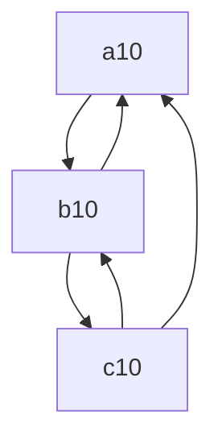

## graph


```mermaid
graph TD;
    a10-->b10;
    b10-->a10;
    b10-->c10;
    c10-->a10;
    c10-->b10;
```

## topological sorting

```
[a10, b10, c10]
```

## execute
```
[a10, b10, c10]
10s
```